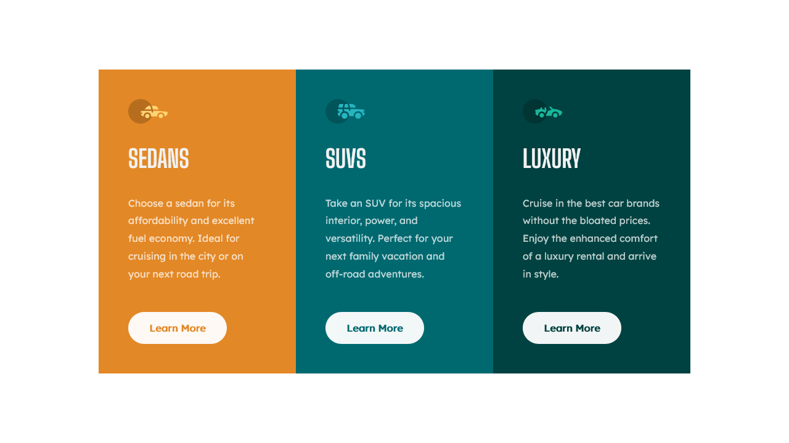
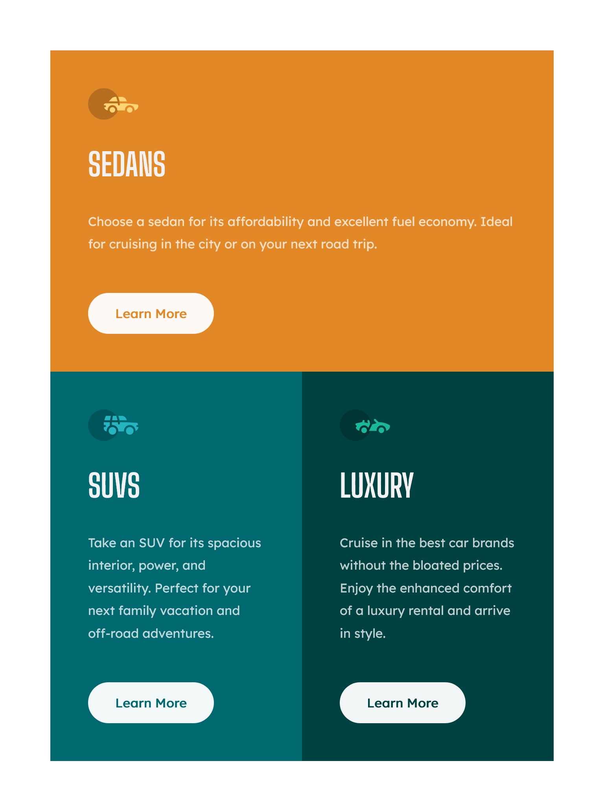

<!-- markdownlint-disable MD033 -->
<h1 align="center">3 Column Card Component</h1>

This is a solution to Frontend Mentor's <a href="">3 Column Card Component.</a>

<!-- markdownlint-enable MD033 -->

## Table of contents

- [Overview](#overview)
  - [The challenge](#the-challenge)
  - [Screenshots](#screenshots)
  - [Links](#links)
- [My process](#my-process)
  - [Built with](#built-with)
- [Author](#author)

## Overview

### The challenge

Users should be able to:

- View the optimal layout depending on their device's screen size
- See hover states for interactive elements

### Screenshots

| Desktop View (1280px) | Tablet View (768px) | Mobile View (375px)|
|-------|-------|-------|
||||

### Links

- Live Site URL: [Cloudfare Pages](https://fm--3-column-card.pages.dev/)

## My process

### Built with

- Semantic HTML5 markup
- Mobile-first workflow
- CSS Custom Properties
- CSS Grid
- Flexbox
- BEM Methodology

## Author

- [My Website](https://amodeusr.pages.dev)
- Github - [@AmodeusR](https://github.com/amodeusr)
- Linkedin - [@AmodeusR](https://www.linkedin.com/in/AmodeusR)
- Frontend Mentor - [@AmodeusR](https://www.frontendmentor.io/profile/AmodeusR)
